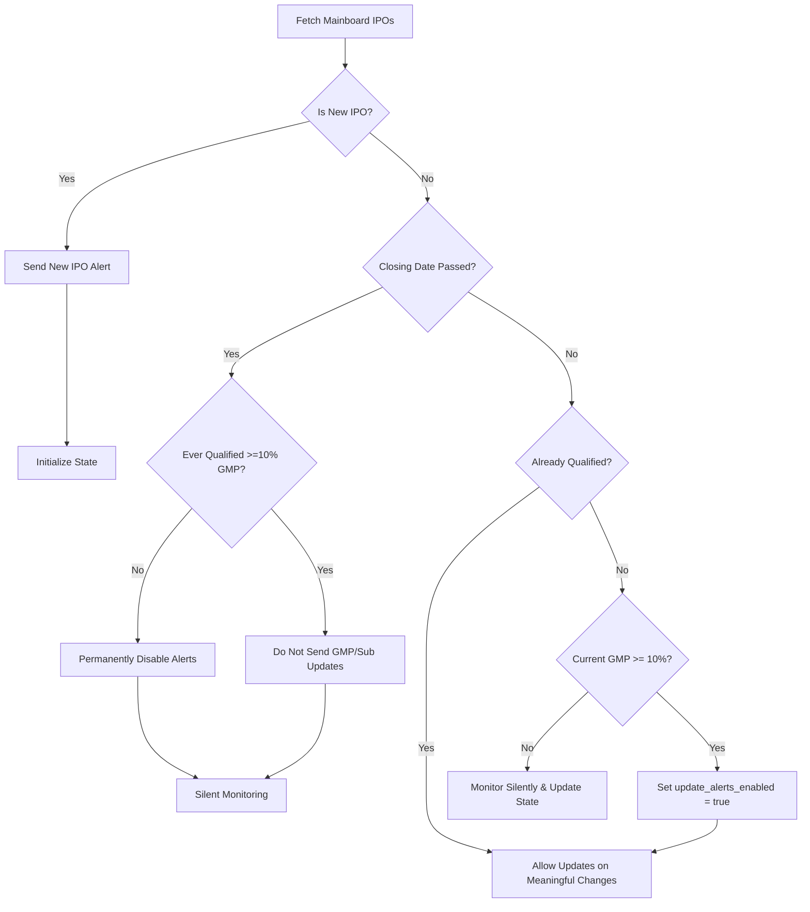

# AlphaIPO_Bot 🚀

An automated Telegram bot that tracks and monitors Indian Mainboard IPOs, providing real-time alerts for Grey Market Premium (GMP) or Retail Subscription (RII) figures, while filtering out low-interest listings to minimize notification noise.

---

## Project Purpose
The purpose of AlphaIPO_Bot is to track Indian Mainboard IPOs, deliver initial discovery alerts, and filter out noise from low-performance IPOs by suppressing follow-up updates (GMP and subscription updates) unless the Grey Market Premium (GMP) crosses a defined minimum interest threshold of **10.0%**.

---

## Main Features

- **Mainboard-Only Filtering**: Exclusively monitors Mainboard IPOs on NSE/BSE. All SME IPOs are completely ignored.
- **Initial Discovery Alert**: Every newly discovered Mainboard IPO is notified via a "New IPO Alert" on discovery, provided its current GMP is positive (> 0.0%). If the initial GMP is <= 0.0%, the alert is deferred until the GMP rises above 0.0%.
- **GMP-Based Update Filter**: Subsequent update alerts are sent only if the IPO reaches or exceeds a **10.0%** GMP threshold during its bidding window.
- **Silent Monitoring**: IPOs with a GMP below 10.0% continue to be tracked silently in the background. If they cross 10.0% before their closing date, they qualify for future alerts.
- **Closing Date Deadline**: Once an IPO's closing date has passed without crossing the 10.0% threshold, it is permanently ignored. No notifications are sent even if GMP increases later.
- **Duplicate Prevention**: Tracks execution history in a persistent state file (`sent_ipos.json`) to prevent duplicate messages and detect meaningful changes.
- **Allotment Links Extraction**: Automatically extracts registrar allotment links (e.g. KFintech, Link Intime, Bigshare) and includes them directly in Telegram alerts.
- **Serverless Automation**: Fully automated using GitHub Actions or external triggers (like cron-job.org).

---

## Notification Logic Flow



### Detailed Rules
- **New Mainboard IPO**: Send a **New IPO Alert** only if the GMP is positive (> 0.0%). If the initial GMP is <= 0.0%, the alert is suppressed on discovery and only sent once/if the GMP crosses above 0.0% while the IPO is active.
- **Before Closing Date**:
  - `GMP < 10%`: Monitor silently (no update alerts, but stored values are updated in state).
  - `GMP >= 10%`: Qualifies for update alerts (sets `update_alerts_enabled = true`). From this point onward, GMP and subscription updates are allowed even if the GMP subsequently falls below 10%.
- **If IPO Closes Below 10%**:
  - Permanently ignores future update alerts for that IPO (sets `update_alerts_permanently_disabled = true`). No further updates or listing alerts are sent.
- **After Closing Date**:
  - No further update alerts (GMP or Subscription updates) are sent for any IPO.
  - For qualified IPOs, the **Listing Today** alert is still sent on its listing date.

---

## Data Sources & Notes

- **IPO Data & Metadata**: Gathered from official exchange sources (NSE/BSE).
- **GMP & Retail Subscription**: Sourced from [InvestorGain](https://www.investorgain.com).
- **Disclaimer**: Grey Market Premium (GMP) is unofficial, unregulated market information. It does not guarantee listing day prices or success, and should never be treated as investment advice or a recommendation.

---

## Project Structure

```text
AlphaIPO_Bot/
├── .github/
│   └── workflows/
│       └── ipo_bot.yml      # GitHub Actions automation workflow
├── config.py                # Config environment variable bindings
├── ipo.py                   # Scraping and processing module (InvestorGain & NSE/BSE)
├── main.py                  # Bot orchestrator and decision logic
├── telegram_bot.py          # Telegram sendMessage HTTP dispatcher
├── message_templates.py     # HTML message templates
├── requirements.txt         # Package dependencies
├── sent_ipos.json           # JSON state database (git-tracked)
└── README.md                # Project documentation
```

---

## Setup & Local Execution

### 1. Prerequisites
- Python 3.8+ installed on your machine.
- A Telegram Bot Token (obtainable from [@BotFather](https://t.me/BotFather)).
- A Target Telegram Chat/Channel ID.

### 2. Installation
Clone the repository and install the dependencies:
```bash
pip install -r requirements.txt
```

### 3. Local Configuration
Set the following environment variables on your system, or create a `.env` / edit `config.py` temporarily (never commit sensitive credentials to git!):

- `BOT_TOKEN`: Your Telegram bot token.
- `CHAT_ID`: Your target Telegram channel or chat ID.

### 4. Running the Bot Manually
Run the main script:
```bash
python main.py
```
On first run, the bot fetches live IPO data, sends "New IPO" alerts for newly discovered listings, and initializes the state in `sent_ipos.json`. Subsequent runs will only alert on qualified updates.

---

## Automation & State Persistence

### GitHub Actions Workflow
The project includes a GitHub Actions workflow in `.github/workflows/ipo_bot.yml`. It runs on a schedule to check for updates.
If updates are found, it sends Telegram notifications, updates `sent_ipos.json`, and commits the changes back to the repository.

To enable this:
1. Add your `BOT_TOKEN` and `CHAT_ID` as Repository Secrets under **Settings > Secrets and variables > Actions**.
2. Grant write permissions to the action under **Settings > Actions > General > Workflow permissions** (select "Read and write permissions").

### External Triggers (e.g. cron-job.org)
Alternatively, you can trigger execution by setting up a webhook or scheduling request using services like [cron-job.org](https://cron-job.org) to hit a repository dispatcher or hosting environment.

---

## Important Security Notes

- **Never Commit Secrets**: Do not write `BOT_TOKEN`, GitHub Personal Access Tokens (PATs), Telegram Chat IDs, or database credentials directly into the source code or `README.md`. Use environment variables or GitHub Secrets.
- **State Git Conflicts**: Ensure GitHub Actions are configured to pull the latest changes before committing `sent_ipos.json` to prevent push conflicts.
